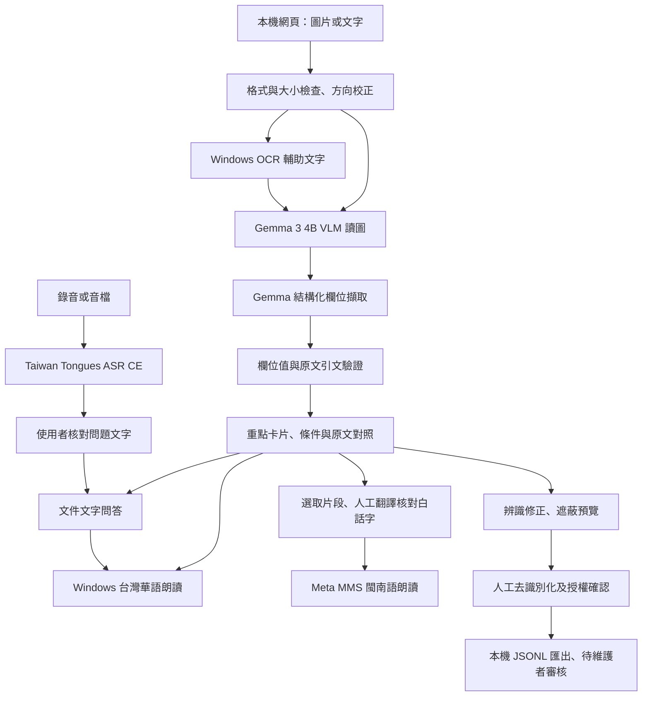

# 紙聲通：具原文依據的生活文書識讀與語音輔助

## 可放進報名表的摘要

紙聲通以長者及閱讀文字較吃力的使用者為服務對象，將生活通知中的辦理事項、期限、地點與應備文件整理成易讀卡片，並提供中文語音朗讀及文件問答。使用者可透過數產署 Taiwan Tongues ASR CE 語音輸入問題，核對轉寫文字後取得附原文依據的回答與朗讀。系統在 Windows 本機整合 Google Gemma 3 視覺語言模型與 OCR 輔助辨識，保留欄位的原文依據，遇到缺漏或無法核對的資訊時提示人工確認。另以 Meta MMS 閩南語模型朗讀人工核對的文件白話字譯文；提供去識別化預覽與自願修正語料匯出機制，作為後續開源資料回饋基礎。本原型的設計重點為降低閱讀門檻、保留資訊來源及避免不確定資訊被直接當成答案。

## 問題與服務對象

- 生活通知包含多個日期與條件，使用者容易混淆發文日、活動日與申請截止日。
- 逐字朗讀難以直接回答「我要做什麼、去哪裡、帶什麼」。
- AI 摘要可能改動條件或數字，因此必須能回看原文件並修正。

第一階段只支援單頁印刷繁中及部分英文／混合文件。藥袋僅可試讀原文，不提供用藥判斷；不以手寫文書作為已驗證能力。

已選定生活通知／公文的期限、應備文件、費用與例外條件作為優化與後續微調主軸。建立 8 個開發文件家族、各兩種影像條件，以及另外 4 個曾保留的家族。後4個家族已在凍結 v9 後執行首次測試，之後用於錯誤診斷；目前已降為回歸資料，不能再稱未見測試。逐輪結果、退步案例與限制見 `ITERATION_LOG.md`；這是小型合成評測，不是一般文件準確率，也不是微調成果。

另取得4份官方公開PDF、選取5頁原始版面，測試正式函文、掃描公告與雙語表格。經跨行段落與欄位語意優化，公文欄位片段／留空檢查由5/20提高至18/20；這批已用於開發，不是保留測試。最新修正讓雙語表格的文件清單恢復顯示，費用欄不再混入下一節標題；仍有OCR錯字、地點／行動語意錯誤與例外漏列，不宣稱問答全部正確。詳見 `evaluation/public-documents/README.md`，可展示失敗如何引導修正，而非宣稱成熟商用準確率。

文件輸入支援上傳照片、貼上文字，以及本機瀏覽器的攝影機預覽／拍照。拍照後可重拍，確認使用才送入相同的辨識流程；拍下或離開預覽即釋放相機。相機生命週期以合成串流測試，實體鏡頭與拍攝清晰度仍需使用者實測。

## 已運行的架構

Gemma 實際處理圖片與文件理解；Windows OCR 提供額外線索。Taiwan Tongues ASR CE 是語音提問入口，與 Gemma 文件問答實質串接；MMS 可朗讀人工核對的文件片段 POJ 譯文，沒有自動翻譯。

## 技術貢獻的誠實說法

1. 將原文、欄位、適用條件及朗讀串成可操作的本機流程。
2. 欄位與引用不相符時，不呈現猜測值；相對期限保留原文，不擅自推算。
3. Gemma 與系統 OCR 的文字可並列核對；它們的一致程度不是準確率。
4. 指定 ASR 以 CPU int8、短句、VAD、beam 1 適配 8GB GPU 筆電，與 Gemma 分配資源；不把微小樣本的時間差宣稱通用加速成果。
5. 自願修正語料採初步遮蔽、人工確認、匯出、維護者複核後才公開。
6. 中文與閩南語 TTS 分別標明來源、授權與限制。

目前尚無經任務評測證明的微調改善，不宣稱自創基礎模型。後續應以不同版面、手機拍攝及真實使用者測試建立效益證據。

獨立的 Ministral 3 3B QLoRA 可行性實驗已完成一個 optimizer step：109 tokens 的虛構通知、約117萬個可訓練參數，52個 adapter 張量確實更新；保存後在獨立程序載入，重現相同 loss，PyTorch 顯存保留峰值約3.99 GiB。詳見 `training/LORA_SMOKE.md`。這只驗證訓練流程，不是公文品質改善，也不屬於指定 ADI 模型的微調成果；adapter 未部署，不能將既有 Gemma 評測分數算給它。

後續文件訓練入口也已完成共用 CUDA 流程驗證：同一固定合成通知以正式問答格式形成229-token序列，完成一步更新、保存、重載；全新程序載入的104個adapter張量與保存檔完全相符，生成答案可重現。但更新前後答案相同，沒有任務改善證據；這是與上述109-token實驗分開的紀錄。正式公文訓練仍缺人工核對資料與獨立test。詳見 `training/DOCUMENT_LORA.md` 及 `evaluation/qa-completeness/cuda-smoke-document-001/`。

主介面另提供「聽回答與依據」，預設朗讀完整引用，讓使用者核對短答可能省略的日期或條件。這是呈現方式改善，不會修正模型答案或保證引用語意正確；實際播放與切換紀錄見 `evaluation/qa-completeness/answer-speech-v1.json`。

## 三分鐘展示流程

| 時間 | 操作 | 要說明的重點 |
|---|---|---|
| 0:00–0:25 | 說明一張補件通知的閱讀困難 | 使用者需要知道期限和應備文件 |
| 0:25–1:15 | 點自製範例，執行真實辨識 | 本機 VLM 與 OCR，等待時間以實際設備為準 |
| 1:15–1:45 | 展開期限、應備文件的原文依據 | 可以核對、可以修正；不保證零錯誤 |
| 1:45–2:05 | 中文朗讀，調整速度 | 已在本機產生 WAV |
| 2:05–2:35 | 語音問「要帶什麼」，核對轉寫後提問並朗讀 | ASR → Gemma → TTS 完整流程；預留十多秒辨識等待 |
| 2:35–3:00 | 修正語料預覽及台語功能說明 | 人工檢查後才匯出；台語為人工翻譯流程 |

模型冷啟動可能超過此節奏，正式展示前先跑一份範例暖機。不要把預先錄影或人工修正文稿冒充當次辨識成果。

## 週一前優先完成

2026-10-01 再次對照[本組官方頁面](https://innoserveawards.tca.org.tw/advertise26_AI-Open_Source.htm)，報名截止仍為 **2026/10/5 16:00（臺灣時間）**。指定模型的加分條件寫的是微調或優化；合成訓練流程成功不能代替指定模型的場景成效。下表逐項區分已有證據與待確認事項，功能已實作不等於主辦已確認資格。

| 要求／工作 | 目前證據與狀態 |
|---|---|
| 使用並上架 GitHub／Hugging Face 等平台 | 公開原始碼：https://github.com/JimmyLiu616/paper-voice；是否符合本組平台及授權要求仍由主辦認定 |
| 核心模型來源及授權揭露 | `MODEL_SOURCES.json` 列出名稱、版本、來源及條款；Gemma 自訂授權的參賽認定待主辦確認 |
| 指定模型實質整合與優化 | ASR → 文件問答已整合；以兩句合成華語驗證，真人語音仍待測試 |
| 多模型／多模態互動 | 圖片、文字、合成語音流程已運行；實體鏡頭、真人語音及台語品質仍待使用者實測 |
| 語料回饋機制 | 修正、遮蔽、確認與匯出已實作；沒有宣稱已公開高品質語料集 |
| 任務微調（可選研究方向） | 共用文件訓練器已在GPU完成一步合成驗證與獨立程序重載；正式資料仍未人工核對，沒有任務改善證據 |
| 老師示範影片 | [v0.1.0-demo](https://github.com/JimmyLiu616/paper-voice/releases/tag/v0.1.0-demo) 已提供約3分9秒MP4與字幕；為真實操作截圖剪輯及另行合成旁白，非連續錄影，未收錄後續「聽回答與依據」及訓練更新 |
| 程式驗證與重建說明 | 最近完整Python測試117項、JavaScript測試21項通過；這些是程式測試，另有小型模型開發評測，不能合併稱為辨識準確率 |
| 隊員、指導老師及報名提交 | 需團隊提供／核對並完成報名；本機檔案不等於完成報名 |

公開儲存庫只含程式、原創範例、測試與說明，沒有模型權重、執行環境、私人上傳或官方 PDF 原檔。已掃描常見金鑰格式與使用者絕對路徑，未命中；這是有限靜態檢查，不是完整資安審核。原始碼依使用者授權公開至 [JimmyLiu616/paper-voice](https://github.com/JimmyLiu616/paper-voice)，後續發布也應維持相同資料排除原則。

- 核對官方報名欄位、隊員與指導老師資料，確認 2026/10/5 下午 4 點截止前完成。
- 展示素材已完成：播放既有MP4，包含短答漏日期後追問，以及文件未提供資訊的拒答；若要現場操作最新版，依 `DEMO.md` 先暖機，並說明影片與目前介面的差異。
- 已完成不同於展示範例的 8 個合成開發文件家族評測；補充真實拍攝與使用者測試，勿把此小樣本稱為一般準確率。
- 請至少一位台語使用者聽試聽結果；若發音不理想，保留實驗標籤，不以流暢母語服務宣傳。
- 維護 GitHub 公開內容：只上傳原始碼、範例、說明、測試；排除 `.venv`、`.runtime`、模型快取及任何真實個資。
- 確認模型授權適用性，特別是 Gemma 自訂條款、MMS 非商業條款與主辦對「開源」的認定。

## 主辦資格詢問文字（待團隊寄送）

主旨：開源AI模型應用組－紙聲通之Gemma 3授權及指定ASR整合認定詢問

主辦您好，我們準備以「紙聲通」參加開源AI模型應用組。作品以Google Gemma 3 4B（Ollama gemma3:4b）作為文件讀圖與理解核心，實質串接數產署Taiwan Tongues ASR CE v1.0作為語音提問入口，並以Windows華語及Meta MMS閩南語提供朗讀。原始碼、模型版本與授權說明已公開於 https://github.com/JimmyLiu616/paper-voice 。

Gemma 3採Google自訂的[Gemma Terms of Use](https://ai.google.dev/gemma/terms)，不是MIT或Apache-2.0；本作品未宣稱其自訂授權已獲本組資格認定。請問這項核心模型是否符合本组所要求的開源模型與授權條件？指定ASR另已以本機CPU int8、短句及VAD整合進文件問答，相關優化與測試範圍均有揭露；請問加分審查是否另有需要補充的證明格式？謝謝。

此文字是供團隊確認後使用的詢問草稿，尚未寄送。不可把草稿視為主辦已答覆或同意。聯絡資訊請以[官方組別頁面](https://innoserveawards.tca.org.tw/advertise26_AI-Open_Source.htm)為準。

## 評測規劃（非已達成成效）

已執行的補充證據：v9 凍結後以4個保留合成文件家族、8張圖片測試，欄位片段檢查35/42、問答檢查12/16；標準文字對照為19/21與7/8。依錯誤修正日期段落與加入有限服務主題檢查後，v11 在同組回歸為37/42與14/16，皆無執行錯誤；這不是新的保留測試。取消期限不再混入預約日期，引用停水卻回答停電的案例被拒答，仍有文件漏字、例外／行動漏抓與不必要拒答。模型語意核對器試驗未達部署條件，沒有微調權重。完整凍結紀錄、失敗輸出及微調判斷見 `evaluation/README.md`、`training/EXPERIMENT_PLAN.md`，不能宣稱一般準確率或完整語意驗證。

- 字元錯誤率：以人工逐字標註為標準，分繁中、英文、正常／反光／模糊照片統計。
- 關鍵欄位：期限、應備文件、地點與金額的正確率、漏抓率、錯填率。
- 問答：有依據問題的正確率、無依據問題的拒答率及錯誤自信回答案例。
- 使用者：對照原文件與工具，量測理解題正確率與完成時間；先做小規模探索。
- 消融比較：Gemma 單獨、Gemma 加 OCR 線索、再加欄位引用驗證。

## 官方與模型來源

- 競賽：https://innoserveawards.tca.org.tw/advertise26_AI-Open_Source.htm
- Gemma：https://huggingface.co/google/gemma-3-4b-it
- 本機量化發行：https://ollama.com/library/gemma3:4b
- 閩南語 TTS：https://huggingface.co/facebook/mms-tts-nan
- 已整合數產署指定 ASR：https://github.com/adi-gov-tw/Taiwan-Tongues-ASR-CE

原始碼儲存庫已公開；模型授權的參賽認定及指定數產署模型加分仍由主辦審查，沒有宣稱已取得。
